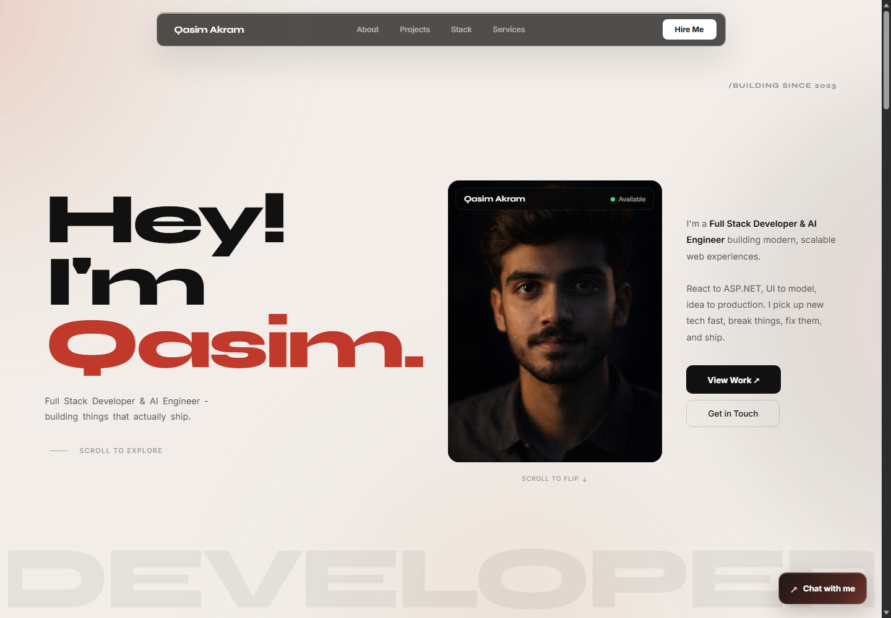

# Qasim Akram — Portfolio

Personal portfolio of **Muhammad Qasim Akram**, a Full Stack Developer and AI Engineer based in Pakistan.

**Live site:** [qasim-akram.netlify.app](https://qasim-akram.netlify.app)



## About

This static portfolio presents my background, selected projects, technical skills, services, and contact information. It is built with plain HTML, CSS, and vanilla JavaScript, with no build step or front-end framework.

## Features

- Responsive layout with a mobile navigation menu
- Animated hero, scroll reveals, and a flip card with profile and social links
- Glass-inspired surfaces and subtle hover and magnetic button interactions
- Project cards, technical skills, and service listings
- Contact form powered by EmailJS
- Built-in portfolio chatbot with preset, local replies and quick commands; it does not connect to an AI model or backend
- Reduced-motion support
- Resume, favicon, and social sharing image in the `img/` folder

## Selected projects

| Project | Description | Technologies |
| --- | --- | --- |
| [ChatRoom](https://chat-room-two-pi.vercel.app/) | Real-time chat rooms with instant messages | React, Django Channels, WebSockets, Redis |
| DevChat | LLM-powered developer assistant with context memory and streaming | React, Node.js, LLaMA 3 |
| EyeSpy | Real-time object detection with audio feedback | Python, OpenCV, YOLOv8 |
| YOUROWN | E-commerce storefront with cart, authentication, and order tracking | React, Node.js, MongoDB, Azure |
| Minimal Analysis | Stock analysis using live market data and an LLM | Express.js, Groq, LLaMA |
| [SmartSpend API](https://github.com/Muhammad-Qasim-Akram/Smartspend.Api) | Expense-tracking backend currently in development | ASP.NET, PostgreSQL |

## Tech stack

- **Frontend:** React.js, JavaScript, TypeScript, HTML5, CSS3, Tailwind CSS
- **Backend:** ASP.NET, Node.js, Django, Express, REST APIs, WebSockets
- **Databases:** PostgreSQL, MongoDB, MySQL, Redis
- **AI and computer vision:** Python, YOLOv8, OpenCV, Groq / LLMs, scikit-learn
- **DevOps:** Git, GitHub, Azure, Vercel, Netlify, GitHub Actions

## Run locally

No install or build command is required. Clone the repository and open `index.html` in a browser:

```bash
git clone https://github.com/Muhammad-Qasim-Akram/Portfolio3D.git
cd Portfolio3D
```

The contact form uses EmailJS, so its submission requires a network connection and valid EmailJS configuration. The chatbot works locally using predefined content and commands.

## Project structure

```text
Portfolio3D/
├── index.html
├── style.css
├── script.js
├── readme.md
├── sitemap.xml
├── robots.txt
└── img/
    ├── favicon.svg
    ├── og-image.png
    ├── portfolio-homepage.png
    └── Muhammad_Qasim_Akram_Resume.pdf
```

## Contact

- **Email:** [qasimakram46@hotmail.com](mailto:qasimakram46@hotmail.com)
- **WhatsApp:** [+92 312 6442266](https://wa.me/923126442266)
- **GitHub:** [Muhammad-Qasim-Akram](https://github.com/Muhammad-Qasim-Akram)
- **LinkedIn:** [qasimakram](https://linkedin.com/in/qasimakram)

## License

MIT — feel free to take inspiration, but please do not copy the portfolio wholesale.
